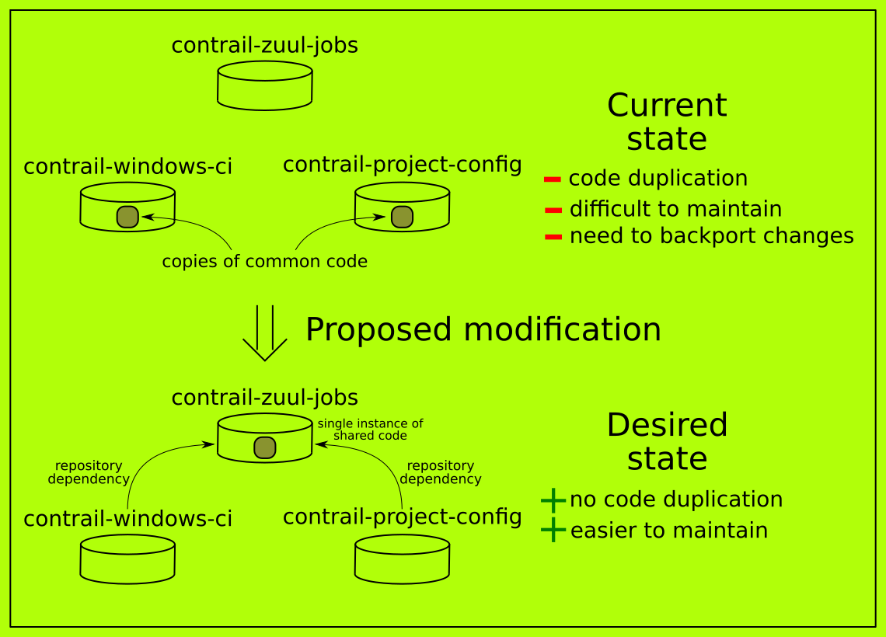

# RFC for CI roles extraction
### An idea to extract common roles for deploying controller from contrail-project-config to be used by Contrail-Windows and DevOps teams.

Author: Katarzyna Rybacka

---

## Abstract

Currently, controller5.0 is being deployed in Contrail-Windows CI using roles copied from `contrail-project-config` repository([Link](https://github.com/Juniper/contrail-project-config)).
There is a need to make this code more generic so it could be used by few teams simultaneously.
This document specifies the proposed solution to this issue and requests discussion and suggestions for
improvements.

## Introduction

In CI, specifically in `contrail-windows-ci` repository ([Link](https://github.com/Juniper/contrail-windows-ci)) there are three roles `contrail-ansible-deployer`, `kolla-provision-dockers`
and `yum-repos-prepare` used to deploy controller5.0. The fact that this code is copied from another repository
could cause some issues e.g. need for backporting code, when any change occures in source code.

## Proposal

The idea is to extract generic code used by Contrail-Windows and DevOps teams to another repository
and make these roles more parameterized. All action steps are proposed to be performed by members of Contrail-Windows team.

### Involved steps

1. Move roles `contrail-ansible-deployer`, `kolla-provision-dockers` and `yum-repos-prepare` to `contrail-zuul-jobs`
   repository ([Link](https://github.com/Juniper/contrail-zuul-jobs)).
2. Remove zuul-specific tasks and code from these roles.
3. Parameterize roles and remove hardcoded parameters by adding variables such as: physical_interface, network_interface.
4. Add default values to new added variables so this change will be transparent for DevOps team.
5. Change provisioning of controller5.0 in Contrail-Windows CI to use `contrail-zuul-jobs` repository instead of roles added to `contrail-windows-ci` repository ([Link](https://github.com/Juniper/contrail-windows-ci)) before.
6. Write tests for these roles and make them run in CI. 
