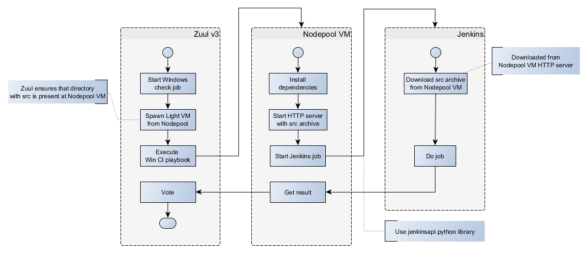

# RFC: Zuul v3 integration with Windows CI

Authors: Jacek Iżykowski, Paweł Marchewka

## Problem statement

Current setup involves separate Zuul v2 instance for Windows CI. Both Zuul instances (Zuul v2 for Windows CI and Zuul v3) vote independently (set verified flag) and are triggered directly by Gerrit. When a patch is finally accepted (code review and tests are successfully passed on both CI systems), Zuul v3 submits proposed change.

This solultion has a few drawbacks:

1. Two separate votes ("Verified" flags) confuse many developers.
2. List of projects is maintained in many places as both systems need to know complete list of projects.
3. It's difficult for Windows CI to access controller compiled from the same sources as Windows components because Windows and Linux builds are triggered independently (and Windows CI doesn't compile controller).
4. Two instances of Zuul (v2 and v3) have to be maintained and updated. It would be beneficial to have less elements that could have negative impact on CI when they fail.

Integration of Windows CI with Zuul v3 has been expected for a long time to be a major improvement. However, Zuul v2 is being used so far as it has direct support for Jenkins (and Zuul v3 doesn't have it). Migration from Jenkins is currently not possible as it requires time investment beyond team's capabilities at this moment. Therefore this is justified to look for some method to integrate Zuul v3 and Jenkins - even if some effort is necessary.

## Proposed improvements

### Seamless Zuul v3 integration through efficient patch processing pipelight

As a solution for described problem, we propose a pipelight (lightweight pipeline) that seamlessly integrates existing Zuul v3 instance with Jenkins server being currently a keystone of Windows CI.

The following actions are going to take place within the proposed setup when relevant event occurs on Gerrit server:

1. Zuul v3 instance is notified by Gerrit about relevant event through an event stream (ssh).
2. Zuul v3 triggers Windows Ci-dedicated job:
    1. New lightweight VM is created by Nodepool.
    2. Zuul v3 uploads all relevant repositories (with proposed patches) to the new VM.
    3. Zuul v3 executes (through Zuul Executor) Ansible playbook with job's definition and Zuul's Tentacle (special Python script) is installed and executed on the VM:
        1. Directories with repository content are archived into a single file.
        2. HTTP server is started to provide the archive in a convenient manner.
        3. Jenkins job in Windows CI is started through Jenkins' REST API (with Jenkins API package). URL to the archive is provided as a job's parameter.
        4. Zuul's Tentacle starts to poll Jenkins server for changes of job's state.
3. Jenkins executes requested job. Instead of using Zuul Cloner (current solution), the job downloads relevant repository content from mentioned lightweight VM through HTTP.
4. Once job's state is updated (success, failure, aborted), Zuul's Tentacle reports the outcome to the Zuul v3 instance.
5. Zuul updates relevant information on Gerrit.

### Pros

The following benefits are expected once proposed solution is implemented:
* Issues mentioned in points (1), (2) and (4) in problem statement are going to be solved.
* Windows job is going to have access to controller build from current patch-set and will be able to get it from specific docker registry - thus issue (3) is going to be solved.

### Cons

* In first step Windows job is going to be scheduled after contrail-vnc-build-containers-centos74, thus it will have negative impact on overall execution time of Zuul v3 check. We are going to improve that by dividing it into two jobs: build and systest. However it is out of the scope of this RFC.
